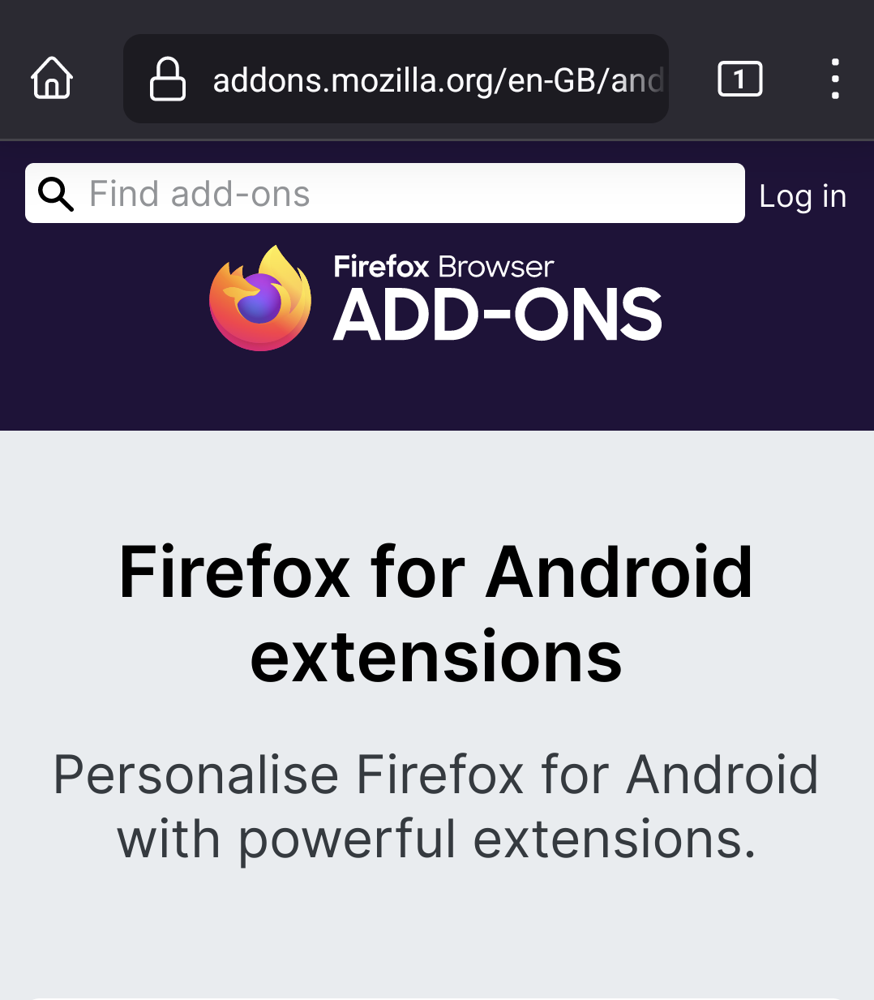
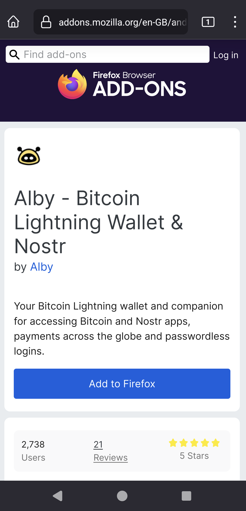
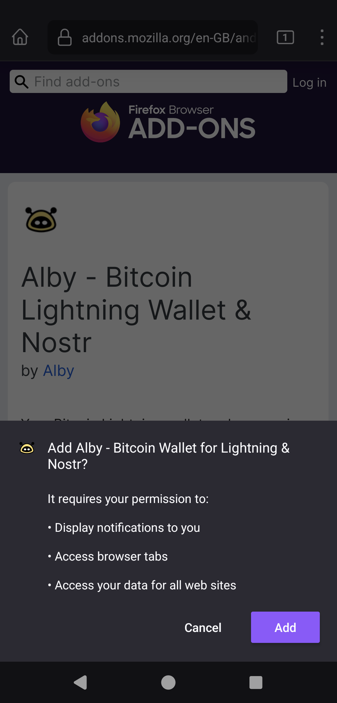
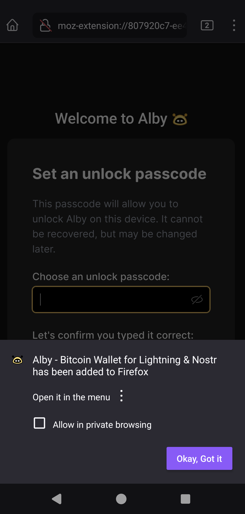
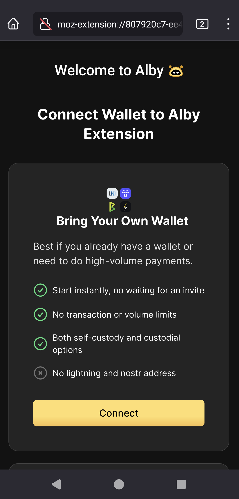
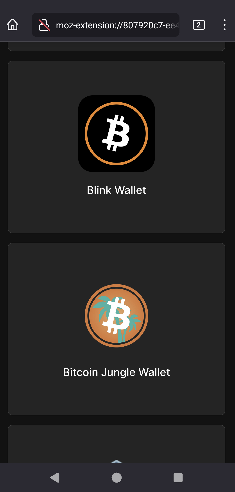
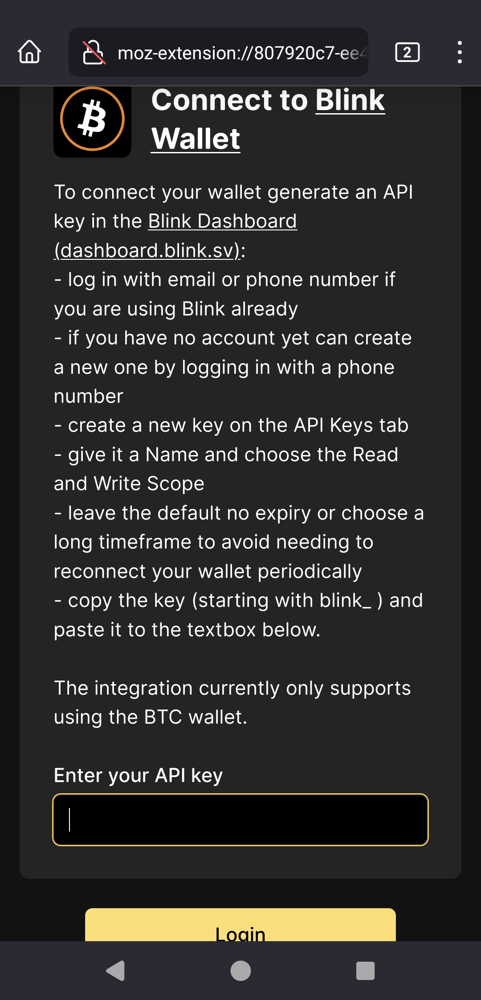
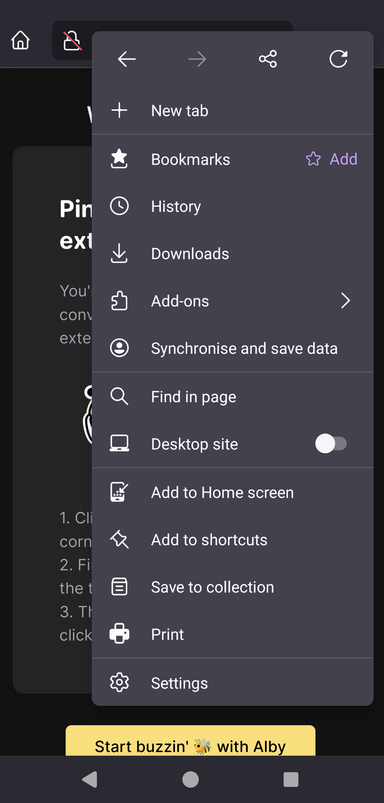
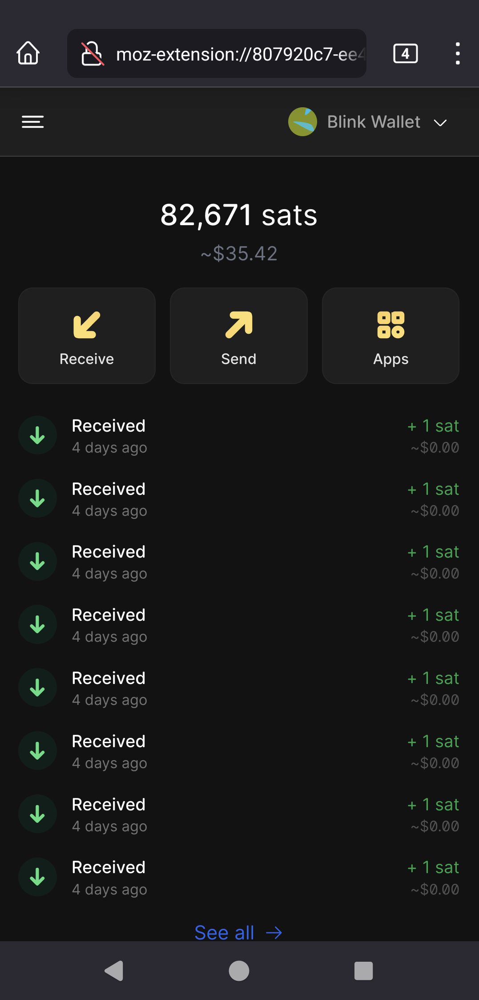

# Connect to the Alby Browser extension on Android

Currently Firefox mobile supports add-ons only on Android.\
Check out our blogpost covering the similar steps using a desktop [blink.sv/blog/blink-alby](https://www.blink.sv/blog/blink-alby).

1. [Download Firefox](https://www.mozilla.org/en-US/firefox/browsers/mobile/android/) on your Android phone
2.  Open Firefox and choose `Add-ons` from the menu on the upper right

    .png>)
3.  Tap `Find more add-ons` on the bottom

    
4.  Type `Alby` to the search box to find the extension

    
5.  Add the extension

    
6.  Confirm

     
7.  Set a passcode

    
8.  Choose `Connect` to Bring Your Own Wallet

    
9.  Scroll down to Blink Wallet

    
10. Follow the instruction on screen - get an API key in a new tab or window. Find more details about the Dashboard and API keys [here](https://dev.blink.sv/api/auth).

    
11. When pasted the API key and connected your Blink account successfully take a moment to bookmark the extension by tapping on `Add` next to `Bookmarks`

    
12. To reach the extension again choose it from Bookmarks in the menu of Firefox

    
13. Once the extension is open choose `Wallet` from it's menu on the top left to access your balance

    
14. Send and receive sats from your Blink BTC wallets in Firefox

    
